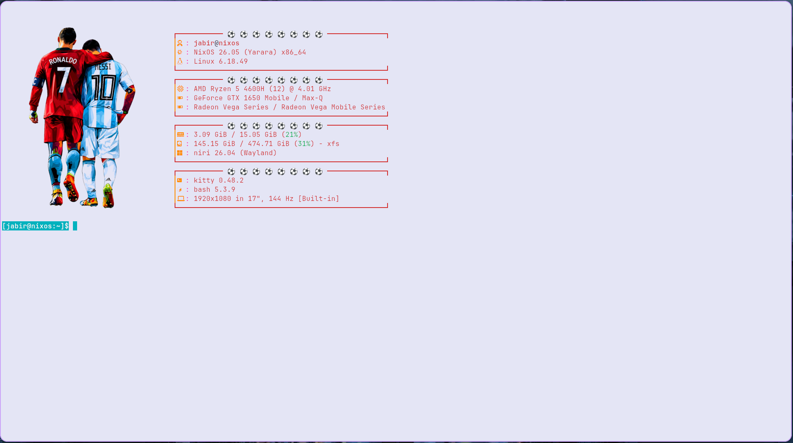

# ⚡ R7-LM10-Fastfetch

<div align="center">

### A minimal Linux terminal setup for Fastfetch & Kitty

Fastfetch • Kitty • JetBrainsMono Nerd Font • Custom Theme

<br>


</div>

---

## 🖥️ Preview

<div align="center">

<!-- Add your screenshot here -->



</div>

---

## ✨ Features

* ⚡ Custom Fastfetch configuration
* 🖼️ Custom Ronaldo logo
* 🐱 Custom Kitty configuration
* 🎨 Custom Kitty theme
* 🔤 JetBrainsMono Nerd Font
* 💾 Automatic configuration backup
* 🐧 Multi-distro support
* 🚀 One-command installation

---

## 🚀 One-Command Installation

Install the complete setup with a single command:

```bash
curl -fsSL https://raw.githubusercontent.com/jabirisazade/R7-LM10-Fastfetch/main/install.sh | bash
```

The installer automatically detects your Linux distribution and installs the required components.

### What gets installed?

```text
Fastfetch
Kitty
JetBrainsMono Nerd Font
Fastfetch configuration
Ronaldo logo
Kitty configuration
Kitty theme
```

---

## 🐧 Supported Distributions

| Distribution  | Support |
| ------------- | :-----: |
| NixOS         |    ✅    |
| Arch Linux    |    ✅    |
| Cachy OS      |    ✅    |
| Manjaro       |    ✅    |
| EndeavourOS   |    ✅    |
| Garuda Linux  |    ✅    |
| Kali Linux    |    ✅    |
| Debian        |    ✅    |
| Ubuntu        |    ✅    |
| Linux Mint    |    ✅    |
| Pop!_OS       |    ✅    |
| elementary OS |    ✅    |
| ArcoLinux     |    ✅    |
---

## 📁 Installed Configuration

### Fastfetch

```text
~/.config/fastfetch/
├── config.jsonc
└── ronaldooo.png
```

### Kitty

```text
~/.config/kitty/
├── kitty.conf
└── current-theme.conf
```

### Fonts

```text
~/.local/share/fonts/
```

---

## 💾 Automatic Backup

The installer protects existing configurations.

If a configuration already exists, it creates a backup automatically:

```text
~/.config/r7-lm10-backup-YYYYMMDD-HHMMSS/
```

This allows you to safely try the setup without losing your previous configuration.

---

## ▶️ Usage

After installation, start Fastfetch:

```bash
fastfetch
```

Launch Kitty:

```bash
kitty
```

---

## 🛠️ Project Structure

```text
R7-LM10-Fastfetch/
│
├── fastfetch/
│   ├── config.jsonc
│   └── ronaldooo.png
│
├── kitty/
│   ├── kitty.conf
│   └── current-theme.conf
│
├── install.sh
│
└── README.md
```

---

## 🎨 Customization

All configuration files are included in the repository, so you can easily modify them for your own setup.

You can change:

* Fastfetch modules
* Logo
* Colors
* Kitty appearance
* Font settings
* Terminal behavior

---

## 📸 Screenshot

To add your own preview screenshot, place an image named:

```text
preview.png
```

in the root of the repository.

The README will automatically display it.

---

## 📜 License

This project is provided for personal and educational use.

Feel free to modify the configuration and create your own Linux rice.

---

<div align="center">

### Made for Linux ❤️

**Jabir Isazade**

[GitHub](https://github.com/jabirisazade)

</div>
